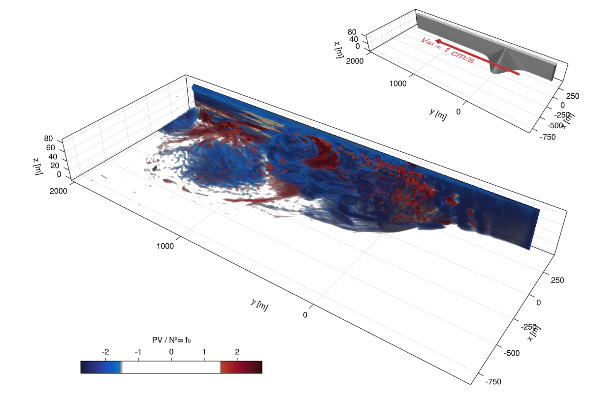

# The turbulent dynamics of anticyclonic submesoscale headland wakes

This is the repository used to generate the data for the manuscript "The turbulent dynamics of
anticyclonic submesoscale headland wakes", by Tomas Chor and Jacob Wenegrat.

1. In order to reproduce results, first run the simulations in the directory `headland_simulations`.
There is a Python script to submit all simulations at once using a PBS scheduler called `run_all_simulations_pbs.py`.
   - Modifiers `-f2`, `-f4`, etc., coarsen the maximum resolution of the simulation by factors of 2
     and 4, respectively. Modifier `-S` flips the direction of rotation.
   - Each simulation is called based on their $Ro_h$ and $Fr_h$. Simulation `R008F008` has
     $Ro_h=Fr_h=0.08$, Simulation `R02F1` $Ro_h=0.2$ and $Fr_h=1.25$, and so on.
   - Simulations are run with Julia (1.10) + Oceananigans, and the exact versions of packages used to run
     everything is contained in the files `Project.toml` and `Manifest.toml`. In order to use them,
     all you need to do is to start Julia with `julia --project` and issue `] instantiate` to
    download the packages. (More information: https://pkgdocs.julialang.org/v1/environments/)
   - Data will be stored in the `headland_simulations/data` directory.
   - You can also run each simulation individually, for example issuing the command `julia --project
     --pkgimages=no headland.jl --simname=NPN-R1F1` runs simulation with `Ro_h=Fr_h=1.25`.
2. After the simulations have run (make sure all of them run until the end, which is 80 advective
   periods) post-processing can be done in the root directory of the repo. It consists on running
   scripts `h01_energy_transfer.py` and `h02_bulkstats.py`, which you can do manually or you can run
   `h00_run_postproc.py`. Even better, you can run `qsub run_postproc.sh` which runs that automatically
   using a PBS scheduler.
   - You will need `pynanigans` v1.1.2 installed somewhere in your `$PYTHONPATH` for the post-processing in this repo to work.
     (Other versions may work too, but have not been tested.) You can find it
     [here](https://zenodo.org/records/14277985) or
     [here](https://github.com/tomchor/pynanigans/releases/tag/v.1.1.2).
   - In order to make sure things run correctly, it's also advised to install the version of the
     Python packages these scripts were tested with. These versions are listed in
     `conda-packages.txt`. You can install them automatically with conda by using the command `conda
     create -n submesoscale_headlands --file conda-packages.txt python=3.12`, which will install them
     in an environment called `submesoscale_headlands`.
   - This step will create post-processed NetCDF datasets in the directory `data_post`
3. After post-processing is done, the paper figures can be plotted using the scripts that start with
   `hplot`. `hplot02_paramspace.py` will create Figure 2 of the paper,
   `hplot06_dissipation_snapshots.py` will create Figure 6, `hplotA2_cyclonic_comparison.py` will
   create Figure A2 and so on.
   - Figures will be created in the directory `figures`.
   - Script `hvid00_facetgrid.py` is a dependence of other scripts. It can generate either figures
     or animations of those figures. It's pretty complex, but also really useful. If you want you
     can ignore it and treat it as a black box.
   - Scripts starting with `aux` are coded like mini-modules that are used by other scripts.
